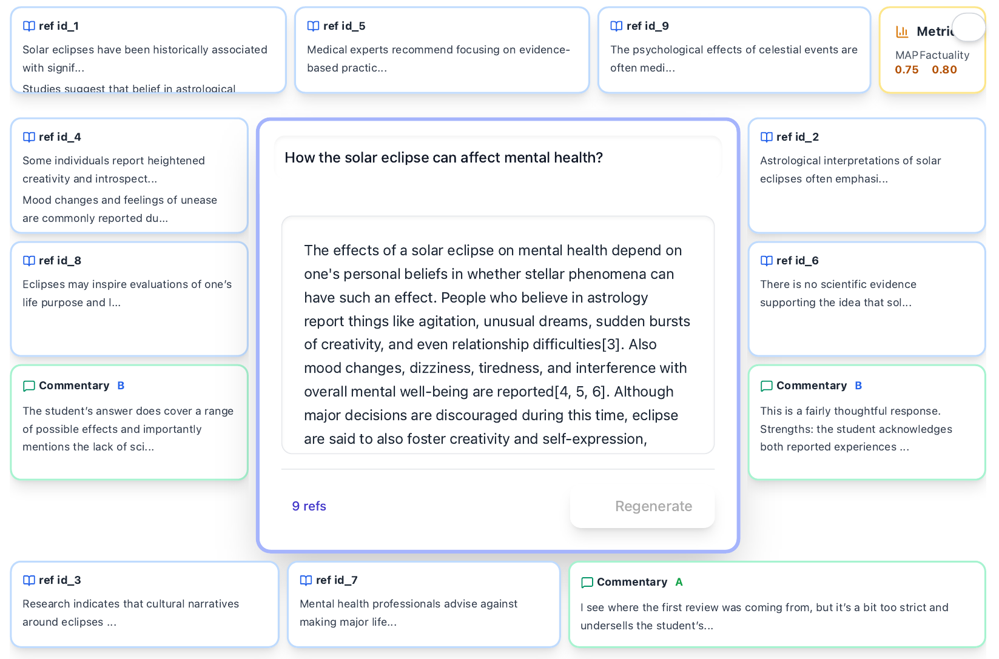

# Demo:	Talmud-IR: A Talmud-Inspired Interface for Discussing RAG Response Quality

Retrieval-augmented generation (RAG) systems promise factually grounded answers, yet evaluating their quality remains difficult. Automated metrics and LLM-as-judge approaches offer scalability but risk circularity, benchmark leakage, and loss of diversity. Human assessors, meanwhile, often struggle to notice subtle omissions or hallucinations when responses appear linguistically fluent and confident. 
We present *Talmud-IR*, a novel user interface inspired by the dialogic structure of the Talmud. It visualizes RAG outputs as a central text surrounded by layers of evidence, commentary, and meta-assessment, enabling sustained human--LLM discussion about system quality and failure priorities. The prototype supports comparative RAG evaluation, collaborative exploration of "unknown unknowns," and pedagogical use for teaching critical reading of AI-generated content.


### Central UI Elements





The **Talmud-IR** prototype adopts the layout of a Talmudic page, transforming evaluation into a structured, multi-voiced dialogue. The interface centers on a query--response pair produced by a RAG system and surrounds it with layers of supporting information and commentary.

-   **Central text (Mishnah):** the user query and the system's generated answer.

-   **Inner margins:** retrieved snippets that provide evidential grounding, highlighting faithful or contradictory citations.

-   **Outer margins (Gemara):** threaded discussions among human experts and LLM-based assessors reflecting on correctness, completeness, tone, or omissions. Comments can reference specific spans of text or earlier remarks, forming a living discourse.

-   **Super-commentaries:** a meta-layer aggregating evaluation metrics such as nugget coverage or citation validity, summarizing consensus across assessors.

The prototype is implemented as a lightweight web application that links textual spans to snippets and commentaries. Selecting a phrase in the central response highlights corresponding evidence; hovering over snippets reveals linked commentary. A sidebar records earlier discussions so recurring issues can be revisited, mirroring how later scholars build upon prior interpretations.

The UI should be tailored to the particular evaluation use case at hand.  For instance,  it can integrate with Nugget-based Evaluation systems to visualize nugget-based metrics alongside qualitative commentary. An alternative configurations invert this hierarchy: a cited document may appear at the center, surrounded by multiple RAG responses that interpret or misinterpret it. This view supports comparative studies of hallucination and evidence selection.

By unifying interpretative discussion with quantitative measures, the system reframes evaluation as an ongoing, collaborative conversation.

## Build and Run Instructions

This project is built using React and styled with Tailwind CSS. Follow the steps below to set up, build, and run the project.

### Prerequisites
1. Ensure you have [Node.js](https://nodejs.org/) installed (version 16 or higher is recommended).
2. Install [npm](https://www.npmjs.com/) or [yarn](https://yarnpkg.com/) as your package manager.

### Setup
1. Clone the repository:
    ```bash
    git clone https://github.com/your-username/dagstuhl-2025-hackathon.git
    cd dagstuhl-2025-hackathon
    ```

2. Install dependencies:
    ```bash
    npm install
    # or
    yarn install
    ```

### Development
To start the development server:
```bash
npm run dev
# or
yarn dev
```
This will start the application on `http://localhost:3000`.

### Build
To create a production build:
```bash
npm run build
# or
yarn build
```
The optimized build will be available in the `dist` directory.

### Run Production Build
To serve the production build locally:
```bash
npm run serve
# or
yarn serve
```

### Tailwind Configuration
Tailwind CSS is configured in the `tailwind.config.js` file. You can customize it as needed.

### Additional Notes
- Ensure you have a `.env` file with the required environment variables if applicable.
- Refer to the project's documentation for more details on features and usage.
